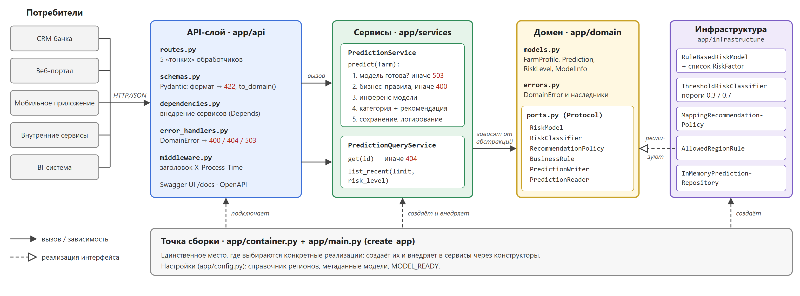

# ПЗ №1. Проектирование AI-сервиса на FastAPI

REST API банковского сервиса агроскоринга: по данным о сельскохозяйственном предприятии
рассчитывает оценку риска, категорию (`low` / `medium` / `high`) и рекомендацию оператору.

- [agro_api/](agro_api) — исходный код сервиса
- [report/](report) — отчёт (LaTeX) и скриншоты

## Запуск

```bash
cd agro_api
python -m venv venv
venv\Scripts\activate
pip install -r requirements.txt
uvicorn app.main:app --reload
```

Swagger UI: http://127.0.0.1:8000/docs

Тесты: `pytest -v`

## Endpoints

| Метод | Путь | Назначение |
|---|---|---|
| GET | `/health` | Проверка работоспособности API |
| GET | `/model-info` | Информация о модели |
| POST | `/predict` | Оценка риска хозяйства |
| GET | `/predictions/{request_id}` | Прогноз по ID |
| GET | `/predictions?limit=&risk_level=` | Список последних прогнозов |

## Архитектура

Код разделён на слои по принципам SOLID:

```
app/
  domain/          сущности, доменные ошибки, абстракции (ports.py)
  services/        сценарии: инференс и чтение прогнозов
  infrastructure/  модель на правилах, постпроцессинг, бизнес-правила, хранилище
  api/             маршруты, Pydantic-схемы, DI, обработка ошибок, middleware
  container.py     точка сборки: выбор конкретных реализаций
  main.py          create_app()
```

Сервисы зависят только от протоколов из `domain/ports.py`. Чтобы заменить модель
(например, на обученную ML-модель) или хранилище (на БД), достаточно написать класс,
реализующий нужный протокол, и подключить его в `container.py`.


